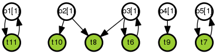

# Brief

Modelling a self-corrective system using PetriNets on the jBPT Java library

# WIP

This project is a *work in progress*. The implementation is *incomplete* and
subject to change. The documentation can be inaccurate.

# Brief Introduction

In the paper "Petri nets: Properties, analysis and applications"
(Proceedings of the IEEE, Volume: 77, Issue: 4, Apr 1989), Professor Tadao Murata
gives an introduction to Petri Nets as well as links to the bibliography, and,
in Section IV, shows some behavioral properties of them, like `boundedness`
(the values of the markings in the net are always bounded), `safeness`, and
`liveness` (pages 7 and 8), and in Section VI, "Characterizations of Liveness,
Safeness, and Reachability", refers to some theorems about these properties for
some known subclasses of Petri nets, like state machines and others (pages 13 to 17).
The paper is available at:
[https://www.cs.uic.edu/~murata/PAPERs/1989.IEEE.Proc.pdf.gz](https://www.cs.uic.edu/~murata/PAPERs/1989.IEEE.Proc.pdf.gz)

# Notes:

A self-corrective system is related to Systems Engineering, for, ideally, a
system in this discipline should have corrective actions, either
interior (self) or exterior corrective actions. Thus, for example, the more
self-corrective a system is, then the more autonomous it can be (ie., the
former is a necessary condition for the latter). Perhaps this could be
expressed in some degree as the `liveness` of the system (mentioned above,
in the introductory paper by Tadao Murata, although `liveness` could be a
stronger condition than `self-corrective`, because, as defined in page 8,
paragraph 2 of that paper:

* *"an initial marking M0 [i.e., initial resources or assignments -my note]
of a system is said to be 'live' if, no matter what marking has been reached
from [this initial marking] M0, it is possible to ultimately fire any
transition of the net by progressing through some further firing sequence"*

It is the last part in that definition,

* *"... if, no matter what marking has been reached from [this initial marking]
M0, __it is possible to ultimately fire any transition of the net by progressing
through some further firing sequence__"*

what seems to be stronger than what we need (self-correction); i.e., does it
need:

* *"... to ultimately fire __any__ transition of the net by ..."*

or merely

* *"... to ultimately fire __some [well-known]__ transitions of the net by ..."*?

This is a very early idea, which needs more analysis and insights).
Returning to the main topic, Petri-Nets are a well-known model to represent
Systems Engineering (see, e.g.,
[ISO/IEC 15909-1:2004 Systems and software engineering -- High-level Petri nets -- Part 1: Concepts, definitions and graphical notation](https://www.iso.org/standard/38225.html)
and
[ISO/IEC 15909-2:2011 Systems and software engineering -- High-level Petri nets -- Part 2: Transfer format](https://www.iso.org/standard/43538.html).)

# Demo

This program reads a Petri Net system from a XML file in [PNML format](https://en.wikipedia.org/wiki/Petri_Net_Markup_Language).

Example execution through Maven:

      $ mvn
      [...]
      Alerts in the system:
      Alert: from 'System resource dimension: CPU available' -- to --> 'handling_my_alert_CPU_Network_Bandwidth'
                   Note: 'We are at this transition once we have received my_alert_CPU_Network_Bandwidth'
       

      Alert: from 'System resource dimension: Disk Space available' -- to --> 'handling_my_alert_Disk_Space'
                   Note: 'We are at this transition once we have received my_alert_Disk_Space'
       
      Alert: from 'System resource dimension: CPU available' -- to --> 'handling_my_alert_CPU'
                   Note: 'We are at this transition once we have received my_alert_CPU'
       
      Alert: from 'System resource dimension: Network Bandwidth available' -- to --> 'handling_my_alert_Network_Bandwidth'
                   Note: 'We are at this transition once we have received my_alert_Network_Bandwidth'
       
      Alert: from 'System resource dimension: RAM available' -- to --> 'handling_my_alert_RAM'
                   Note: 'We are at this transition once we have received my_alert_RAM'
       
      Alert: from 'System resource dimension: Disk I/O available' -- to --> 'handling_my_alert_Disk_IO'
                   Note: 'We are at this transition once we have received my_alert_Disk_IO'
       
      Alert: from 'System resource dimension: Network Bandwidth available' -- to --> 'handling_my_alert_CPU_Network_Bandwidth'
                   Note: 'We are at this transition once we have received my_alert_CPU_Network_Bandwidth'
        
        
      Corrective Actions in the system:
      Corrective-Action: from 'handling_my_alert_RAM' -- to --> 'System resource dimension: RAM available'
                   run : command: 'fix_alert_RAM.py' args: 'other args'
      Corrective-Action: from 'handling_my_alert_CPU' -- to --> 'System resource dimension: CPU available'
                   run : command: 'fix_alert_CPU.py' args: 'some args'
      Corrective-Action: from 'handling_my_alert_Disk_Space' -- to --> 'System resource dimension: Disk Space available'
                   run : command: 'fix_alert_Disk_Space.py' args: 'yet another args'
        
      Alerts without Corrective Actions (possible page out?):
      Alert without corrective-action: 'handling_my_alert_Disk_IO'
      Alert without corrective-action: 'handling_my_alert_CPU_Network_Bandwidth'
      Alert without corrective-action: 'handling_my_alert_Network_Bandwidth'

The program uses JBPT to render the model as a PNG file (you need to install the `graphviz` package in RedHat and Debian. To install `graphviz` in another O.S., refer to [https://graphviz.gitlab.io/download/](https://graphviz.gitlab.io/download/) --note: I'm not sure if it is able to render in Mac OS though, [https://github.com/BPT-NH/jpbt/blob/master/jbpt-core/src/main/java/org/jbpt/utils/IOUtils.java#L29-L31](https://github.com/BPT-NH/jpbt/blob/master/jbpt-core/src/main/java/org/jbpt/utils/IOUtils.java#L29-L31), and then it should show a caught exception with message `Can not find Graphviz binary!`). An example of the rendering:

